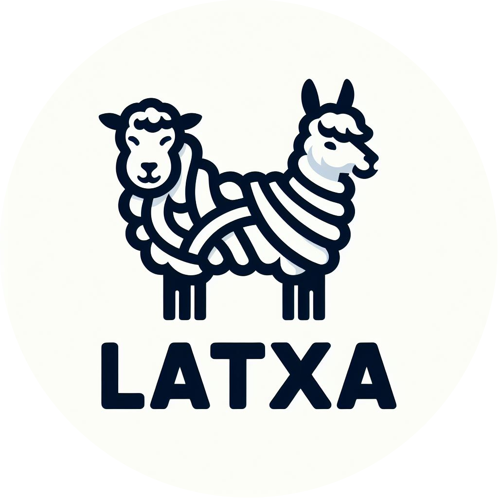

<p align="center">
    <br>
    
    <br>
    <h1 align="center">Latxa-Instruct:<br> Basque Instruct Models and Evaluation Arena</h1>
</p>

<p align="center">
    <a href="https://github.com/hitz-zentroa/latxa-instruct/blob/main/LICENSE"></a>
    <a href="https://huggingface.co/collections/HiTZ/latxa-instruct-682f356091452b0028380804"></a>
    <a href="https://www.hitz.eus/en/node/340"></a>
    <a href="https://arxiv.org/abs/2403.20266"></a>
    <br>
    <a href="http://www.hitz.eus/"></a>
    <a href="http://www.ixa.eus/?language=en"></a>
    <br>
    <br>
</p>

**Latxa-Instruct** is an open-source project for reproducible training, evaluation, and benchmarking of Basque instruction-tuned language models. It provides:

- **Open-source Basque LLMs**: Instruction-tuned models based on Llama 3.1 (8B and 70B parameters)
- **Synthetic instruction datasets**: Large-scale generated instruction-response pairs in both Basque and English for reproducible training
- **Human preference dataset**: The first preference dataset in Basque with real user prompts, model responses, and 12,890 preference annotations from 1,285 participants
- **Complete training pipeline**: End-to-end scripts for data preprocessing, model training, and instruction-tuning on the CINECA Leonardo supercomputer
- **Benchmark evaluation framework**: Benchmarking scripts and results across 29 datasets in Basque, English, and Spanish
- **Human evaluation framework**: Full frontend and backend implementation for community-driven human evaluation of language models

All models, datasets, and evaluation tools are released under open licenses.


- 📒 Blog Post: TBA
- 📖 Paper: TBA
- 🤗 Models and Data: [HiTZ/Latxa-Instruct](https://huggingface.co/collections/HiTZ/latxa-instruct-682f356091452b0028380804)

---

# Datasets

> 🚧 **Note**: The codebase is currently work in progress. Meanwhile, all datasets are available on Hugging Face.
> 
- **Corpus:** Basque corpus of 4.3M documents
  - https://huggingface.co/datasets/HiTZ/latxa-corpus-v1.1
- **Instructions:** [Magpie](https://github.com/magpie-align/magpie)-generated Basque/English instructions
  - https://huggingface.co/datasets/HiTZ/Magpie-Llama-3.1-8B-Instruct-Filtered-1M
  - https://huggingface.co/datasets/HiTZ/Magpie-Llama-3.1-8B-Instruct-Filtered-translated-1M
- **Preferences:** Human preferences on model outputs from 21 different LLMs, in response to real Basque prompts
  - https://huggingface.co/datasets/HiTZ/ebaluatoia

# Model training

> 🚧 **Note**: The codebase is currently work in progress and will require adaptation to your specific environment and setup.

Training is performed on the CINECA Leonardo cluster using [Axolotl](https://github.com/axolotl-ai-cloud/axolotl) (a HuggingFace-based framework).  
See [model_training/README.md](model_training/README.md) for full instructions, environment setup, and troubleshooting.

### Quicksteps

1. **Prepare the data**  
   Preprocess instruction datasets and Basque corpora using scripts in [model_training/](model_training/). For example:
   ```bash
   sbatch model_training/train_scripts/prepare_data.sh
   ```
   This will tokenize and cache datasets as specified in the YAML configs.
2. **Train the models**  
   Launch training with the provided SLURM scripts:
   ```bash
   sbatch model_training/train_scripts/Latxa-Llama-3.1-70B-Instruct-exp_2_101.sh
   ```
3. **Merge and transfer checkpoints**  
   After training, merge distributed checkpoints and transfer to the target server using `merge_weights.sh` and `rsync_weights.sh`.

### Training Configs

- All configs are in [model_training/train_configs/](model_training/train_configs/).
- Datasets are in JSONL format, with user/assistant conversations.
- Example config: [exp_1_010_fixed.yaml](model_training/train_configs/exp_1_010_fixed.yaml)

# Evaluation

Our evaluation framework combines two complementary approaches to provide comprehensive model assessment: benchmark-based evaluation and human preferences.  
See [evaluation/README.md](evaluation/README.md) for full instructions, environment setup, and troubleshooting.

### Static Benchmarks
- **29 benchmarks** across Basque, English, and Spanish
- **6 categories**: reading comprehension, common sense, linguistic proficiency, knowledge, math & reasoning, and bias
- Automated evaluation using [LM Evaluation Harness](https://github.com/EleutherAI/lm-evaluation-harness)
- Full configuration files and results included

### Human Evaluation: _Ebaluatoia_ arena
- **Community-driven evaluation** with 1,285 Basque speakers
- **12,890 preference annotations** collected over 14 days
- **Multi-dimensional assessment**: content quality, linguistic quality, and overall preference
- **21 models evaluated** including our variants, GPT-4o, and Claude 3.5 Sonnet
- Complete arena platform implementation provided

---

# A note on model variants and their nomenclature

We use different naming conventions in the paper versus the codebase for clarity and simplicity respectively.

### Paper Nomenclature

In the paper, we use descriptive names like:
- $INST_{EN}  C_{EU}  I_{EN}$= Llama 3.1 Instruct + Basque Corpus + English Instructions
- $BASE_{EU}  C_{EU}  I_{EN+EU}$ = Latxa Base + Basque Corpus + English & Basque Instructions

### Codebase Nomenclature

In the actual code, models, and evaluation results, we use a simplified format

`exp_{BACKBONE}_{CORPUS_EU}{INST_EU}{INST_EN}`

where:

- **BACKBONE:**
  - `0` = $BASE_{EN}$ (Llama 3.1 8B)
  - `1` = $BASE_{EU}$ (Latxa 3.1 8B) 
  - `2` = $INST_{EN}$ (Llama 3.1 8B Instruct)

- **CORPUS_EU / INST_EU / INST_EN:**
  - `0` = not used
  - `1` = used

**Examples:**
- `exp_1_101` = $BASE_{EU}$ + Basque Corpus + English Instructions
- `exp_2_111` = $INST_{EN}$ + Basque Corpus + Basque Instructions + English Instructions

### Model Repositories

All 8B model variants are available as branches in the HuggingFace repository:
- Main model: https://huggingface.co/HiTZ/Latxa-Llama-3.1-8B-Instruct
- Example variant: https://huggingface.co/HiTZ/Latxa-Llama-3.1-8B-Instruct/tree/exp_0_010

---

# Citation

If you use Latxa-Instruct, please cite:

```bibtex
@misc{sainz2025instructing,
    title = {Instructing Large Language Models for Low-Resource Languages: A Systematic Study for Basque},
    author = {Oscar Sainz and Naiara Perez and Julen Etxaniz and Joseba Fernandez de Landa and Itziar Aldabe and Iker García-Ferrero and Aimar Zabala and Ekhi Azurmendi and German Rigau and Eneko Agirre and Mikel Artetxe and Aitor Soroa},
    year = {2025},
    eprint = {TBP},
    archivePrefix = {arXiv},
    primaryClass = {cs.CL}
}
```

---

# Acknowledgements

This work has been partially supported by the Basque Government (IKER-GAITU project), the Ministerio para la Transformación Digital y de la Función Pública (EU – NextGenerationEU,
2022/TL22/00215335), and trained on the Leonardo supercomputer at CINECA under EuroHPC Joint Undertaking, project EHPC-EXT-2024E01-042.
