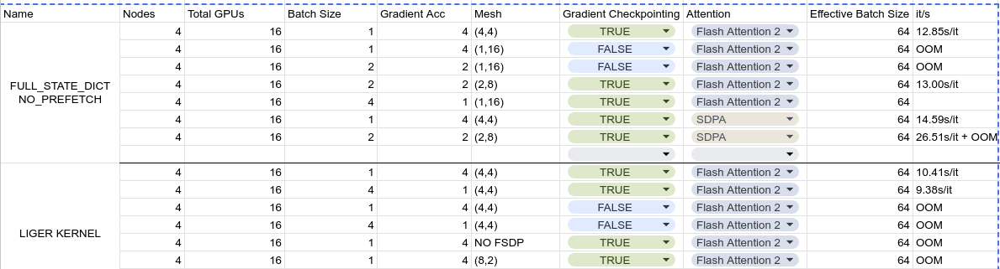

# Model Training in Leonardo
### Iker García (Last Update: Dec 31, 2024)

- [Axolotl](#axolotl)
   * [Prepare the data](#prepare-the-data)
      + [Magpie 8B instructions](#magpie-8b-instructions)
      + [Magpie 70B instructions](#magpie-70b-instructions)
      + [Instruction datasets preprocessing](#instruction-datasets-preprocessing)
   * [Train the models](#train-the-models)
      + [Train configs](#train-configs)
      + [Train scripts](#train-scripts)
   * [Performance tips](#performance-tips)

# Axolotl

> https://github.com/axolotl-ai-cloud/axolotl

Axolotl is a wrapper in top of huggingface. It deals with proper tokenization and mask generation of instruction tunning datasets, as well as implementing some tricks and optimizations for faster training. It has a big community that fixes bugs and implements new models/algorithms very fast. Altough, it is still based on the huggingface codebase, so training speed and memory usage are poorly optimized in comparison with other frameworks such as NEMO. 

<!-- TOC --><a name="prepare-the-data"></a>
## Prepare the data

Axolotl expects the data in `JSONL` format.
```python
# Next Token Prediction dataset
{"text": "This is a test text"}

# Instruction tunning dataset
{"conversations": [{"role": "user", "content": "The distance to the moon is 384,400 km. if you travel to the moon at 20 km/s what is the time needed to get to the moon?"}, {"role": "assistant", "content": "## Step 1: Identify the formula to calculate time\nTo find the time needed to travel to the moon, we can use the formula: time = distance / speed.\n\n## Step 2: Plug in the values for distance and speed\nGiven that the distance to the moon is 384,400 km and the speed of travel is 20 km/s, we can substitute these values into the formula: time = 384,400 km / 20 km/s.\n\n## Step 3: Perform the calculation\nNow, we calculate the time: time = 384,400 km / 20 km/s = 19,220 seconds.\n\n## Step 4: Convert the time to a more meaningful unit (optional)\nSince 19,220 seconds is a large number of seconds, we can convert it to hours for better understanding. There are 3600 seconds in an hour, so: 19,220 seconds / 3600 seconds/hour = 5.34 hours.\n\nThe final answer is: 19,220"}]}
```

I have downloaded and preprocessed the Latxa Text dataset into `$WORK/datasets/PretrainDatasets/`. The script used to download this data can be found here: [../dataset/download_latxa_corpus.py](../dataset/download_latxa_corpus.py)

For the Instruction tunning data, we have 4 different datasets generated with [Magpie](https://github.com/magpie-align/magpie). For more info on how to generate these datasets, refer to [../dataset/README.md](../dataset/README.md). 

<!-- TOC --><a name="magpie-8b-instructions"></a>
#### Magpie 8B instructions
Generated with `meta-llama/Llama-3.1-8B-Instruct`
- [HiTZ/Magpie-Llama-3.1-8B-Instruct-Unfiltered](https://huggingface.co/datasets/HiTZ/Magpie-Llama-3.1-8B-Instruct-Unfiltered): 3,640,000 Instructions
- [HiTZ/Magpie-Llama-3.1-8B-Instruct-Filtered](https://huggingface.co/datasets/HiTZ/Magpie-Llama-3.1-8B-Instruct-Filtered): 2,353,894 Instructions

> In these datasets, you might want to remove the instructions with the `conversation_id` set to `translation_X` as they doesn't seem to be of good quality. 

<!-- TOC --><a name="magpie-70b-instructions"></a>
### Magpie 70B instructions

Generated with `meta-llama/Llama-3.1-70B-Instruct`
- [HiTZ/Magpie-Llama-3.1-70B-Instruct-Unfiltered](https://huggingface.co/datasets/HiTZ/Magpie-Llama-3.1-70B-Instruct-Unfiltered): 3,740,000 Instructions
- [HiTZ/Magpie-Llama-3.1-70B-Instruct-Filtered](https://huggingface.co/datasets/HiTZ/Magpie-Llama-3.1-70B-Instruct-Filtered): 2,839,853 Instructions

> These datasets are a concatenation of the 1M instructions from [Magpie-Align/Magpie-Llama-3.1-Pro-1M-v0.1](https://huggingface.co/datasets/Magpie-Align/Magpie-Llama-3.1-Pro-1M-v0.1) + 2,7M new instructions. 
> Similar to the 8B instructions, the `translation_X` instructions are not good. 

<!-- TOC --><a name="instruction-datasets-preprocessing"></a>
### Instruction datasets preprocessing

The script [../dataset/download_magpie.py](../dataset/download_magpie.py) downloads and preprocesses the datasets. It will generate 2 versions for each dataset, one with all the filtered instructions, and another one with only 1M randomly selected instructions. The preprocessed datasets are already available in `$WORK/datasets/InstructDatasets/`

Important! The datasets are preprocessed using the `user/assistant` format (not the sharegpt format):
```python
# Instruction tunning dataset
{"conversations": [{"role": "user", "content": "The distance to the moon is 384,400 km. if you travel to the moon at 20 km/s what is the time needed to get to the moon?"}, {"role": "assistant", "content": "## Step 1: Identify the formula to calculate time\nTo find the time needed to travel to the moon, we can use the formula: time = distance / speed.\n\n## Step 2: Plug in the values for distance and speed\nGiven that the distance to the moon is 384,400 km and the speed of travel is 20 km/s, we can substitute these values into the formula: time = 384,400 km / 20 km/s.\n\n## Step 3: Perform the calculation\nNow, we calculate the time: time = 384,400 km / 20 km/s = 19,220 seconds.\n\n## Step 4: Convert the time to a more meaningful unit (optional)\nSince 19,220 seconds is a large number of seconds, we can convert it to hours for better understanding. There are 3600 seconds in an hour, so: 19,220 seconds / 3600 seconds/hour = 5.34 hours.\n\nThe final answer is: 19,220"}]}
```

In addition, we use 1000 Basque instructions and 1000 English instructions for validation during training. You can download them with the following code:

```python
# AYA Basque Instructions
import os 
import multiprocessing as mp
from datasets import load_dataset
from tqdm.notebook import tqdm
import json

def process_data(elem):
    if elem["language_code"] == "eus":
        prompt = elem["inputs"]
        targets = elem["targets"]
        conversation = [
            {"role": "user", "content": prompt},
            {"role": "assistant", "content": targets}
        ]
        json_data = json.dumps({"conversations": conversation}, ensure_ascii=False)
        return json_data + '\n'
    return None

def process_and_update(x):
    result = process_data(x)
    return result

def process_split(split, path):
    ds = load_dataset("CohereForAI/aya_dataset", "default", split=split)
    with tqdm(total=len(ds), desc=f"Writing AYA {split}") as pbar, open(path, "a", encoding="utf8", buffering=1024**2) as f:
        pool = mp.Pool(processes=mp.cpu_count())
        for result in pool.imap_unordered(process_and_update, ds):
            if result is not None:
                f.write(result)
            pbar.update(1)
        pool.close()
        pool.join()

os.makedirs("~/work_dir/datasets/InstructDatasets/", exist_ok=True)
splits = ["train", "test"]
path = "~/work_dir/datasets/InstructDatasets/AYA.jsonl"

for split in splits:
    process_split(split, path)
```

```python
# English Magpie Ultra instructions
import random
random.seed(33)

ds = load_dataset("argilla/magpie-ultra-v0.1",split="train")

def deduplicate_by_prompt(ds):
    prompts = set()
    deduplicated = []
    for example in ds:
        prompt = example[0]["content"]
        if prompt not in prompts:
            prompts.add(prompt)
            deduplicated.append(example)
    print(f"Original: {len(ds)}, Deduplicated: {len(deduplicated)}")
    return deduplicated

def preprocess(example):
    instructions = example["instruction"]
    response = example["response"]
    conversation = [
        {"role": "user", "content": instructions},
        {"role": "assistant", "content": response}
    ]
    return conversation

def write_dataset(ds, path):
    print(f"Writing {path}")
    with open(path, "w", encoding="utf8", buffering=1024**2) as f:
        for example in ds:
            json.dump({"conversations":example}, f, ensure_ascii=False)
            f.write('\n')
            
ds = [preprocess(example) for example in ds]

ds = deduplicate_by_prompt(ds)

write_dataset(ds, "~/work_dir/datasets/InstructDatasets/Magpie-Ultra-50K.jsonl")

# Random sample 1000 examples
ds = random.sample(ds, 1000)

write_dataset(ds, "~/work_dir/datasets/InstructDatasets/Magpie-Ultra-1K.jsonl")
```

<!-- TOC --><a name="train-the-models"></a>
## Train the models

The environment used to train the models is `~/venv/latxa-instruct/bin/activate` this environment was created by `Ekhi Azurmendi`.
> ⚠️  Please, do not modify the sacred environment. It is not easy to install all the dependencies and it was necessary to do many tricks to make it work. If you touch something, you might break it, and installing everything from scratch will be a MASSIVE PAIN. If you want to do any change, create a new one. 

We also use a custom accelerate version that supports FSDP2 found in `https://github.com/hitz-zentroa/accelerate` which was created by `Ekhi Azurmendi` and `Iker García`. 

<!-- TOC --><a name="train-configs"></a>
### Train configs:

There are 4 training configs in [./train_configs/](./train_configs/). 

They are mostly self-explanatory. Just a few comments
- Batch size = `micro_batch_size` * `gradient_accumulation_steps` * `num_gpus` (We use FSDP + DP)
- We use the same hparams as the ones used to train `LatxaTxat NEMO` by Aimar. 
- I decided to use `neftune_noise_alpha: 5`, It should improve the model, but I did not test it by myself https://huggingface.co/docs/trl/sft_trainer#enhance-the-models-performances-using-neftune
- We use `liger` kernels, which improve train speed and memory usage

<!-- TOC --><a name="train-scripts"></a>
### Train scripts

There are 4 training scripts in [./train_scripts/](./train_scripts/)

You need to do the following 4 steps to train a model:

1) Preprocess the data. Axolotl will tokenize and prepare the data before training, if you run the preprocessing in multiple nodes it will probably fail, and you will waste a lot of node-hours on a CPU-only task. Preprocessing can take up to ~4 hours depending on the size of the data. So first run `sbatch ./train_scripts/prepare_data.sh` it will preprocess the dataset in the `dataset_prepared_path` you have set in the `train_config.yaml`. This script will use `boost_usr_prod` partition for 2 reasons, first because we need more than the 4 hours and 32Gb RAM limit in the `lrd_all_serial` partition. Second, because even though axolotl doesn't use a GPU during this step, you must unset the `bf16` flag in the config or the code will fail because there is not a `bf16` device available (Fixed in newer versions of axolotl: https://github.com/axolotl-ai-cloud/axolotl/pull/1140/files). If the preprocessing fails, delete that data before running the script again to avoid issues. 

2) Run the training. You might get many different errors at the beginning of the training `NVCC timeout`, `Unsupported device`, `Unable to setup node`, etc, etc, etc... Just launch the script again until it works. Once the training starts, it will probably not crash. But check your script regularly, because `NVCC timeouts` can take a lot of time to exit, so even if the training crashes, the script will not exit in a long time, wasting node hours.

3) At the end of training, accelerate is supposed to merge all the shards from all the GPUs. It won't work. After the last training iteration, the script will fail with the error `[rank16]:[E1228 15:44:53.523176693 ProcessGroupNCCL.cpp:607] [Rank 0] Watchdog caught collective operation timeout: WorkNCCL(SeqNum=264290, OpType=_ALLGATHER_BASE, NumelIn=54528000, NumelOut=218112000, Timeout(ms)=600000) ran for 600018 milliseconds before timing out.`. Do not panic, before this error, accelerate saves a distributed checkpoint that can be found in your checkpoint folder. You can manually merge this checkpoint. See [./train_scripts/merge_weights.sh](./train_scripts/merge_weights.sh) for an example. It will take ~2 mins. You need to use `boost_usr_prod` partition because this process uses a LOT of RAM. 

4) Copy the merged model and the tokenizers from leonardo to the Hitz servers. A barbaric and uncivilized person would use `scp` for this task. We are not that type of person. We use `rsync` which supports file compression, is faster, more stable, and can restore progress if the transfer fails. You can use [./train_scripts/rsync_weights.sh](./train_scripts/rsync_weights.sh) for this task. 

<!-- TOC --><a name="performance-tips"></a>
## Performance tips


<!-- TOC --><a name="time-to-train-the-current-hparams-search-configs-32-nodes-128gpus"></a>
#### Time to train the current hparams search configs (32 nodes - 128GPUs)
- llama-3.1-8B_1M_1epoch: `3:58:02`
- llama-3.1-8B_1M_4epoch: `15:14:00`
- llama-3.1-8B_Full_1epoch: `4:35:28`
- llama-3.1-8B_Full_4epoch: `17:45:58`

<!-- TOC --><a name="quota"></a>
### Quota:

- Starting quota: `4.5%`
- Quota after training the 4 models: `5,2%`

